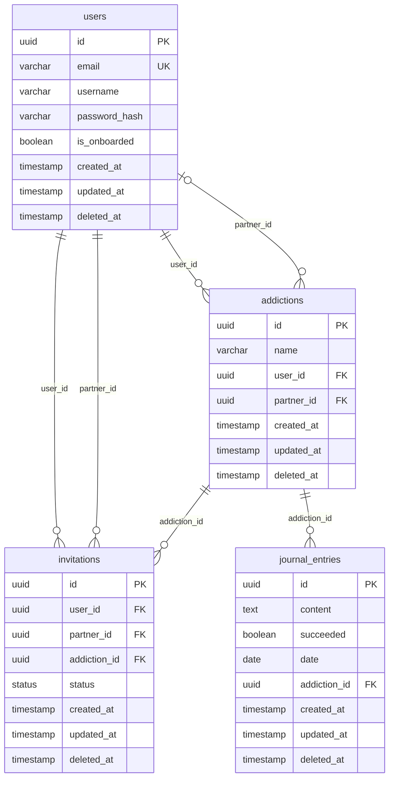

# Setup commands
## Start database container
docker compose up -d

## Run schema migrations
npx drizzle-kit push

## Start development server
npm run dev

# Auth flow

- Mechanism: Authorization: Bearer header
- Token expiration: 1 hour

# Database Schema
